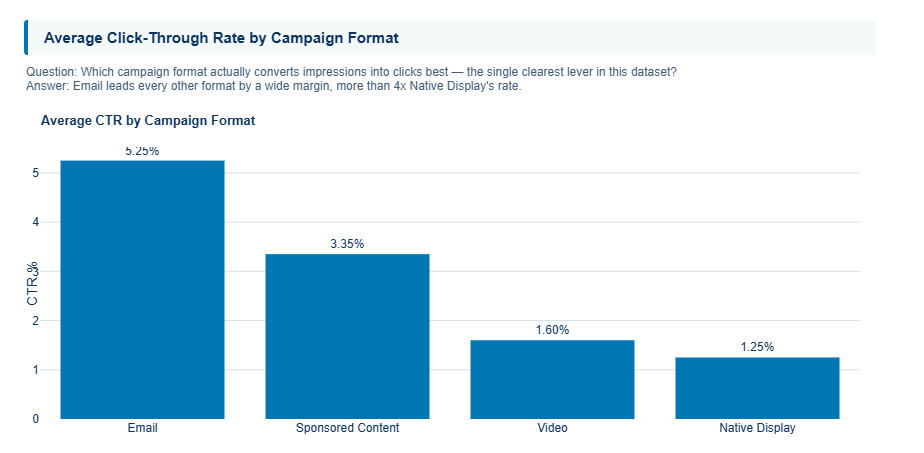
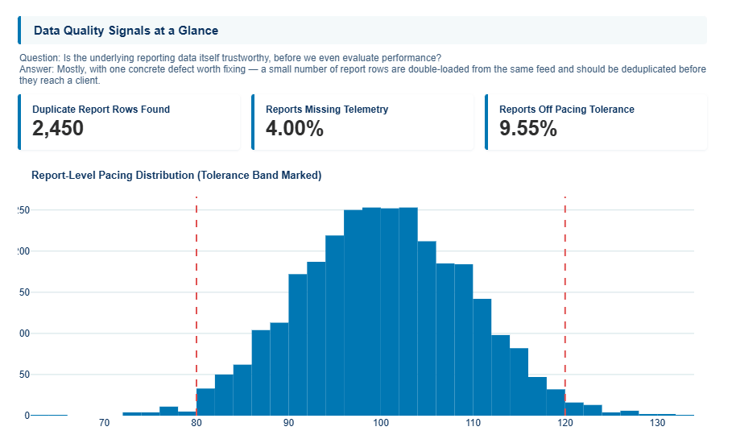
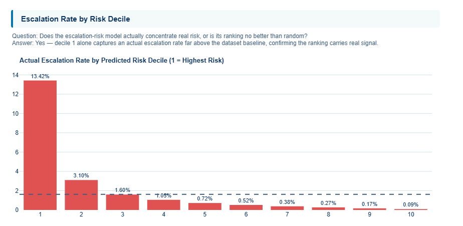
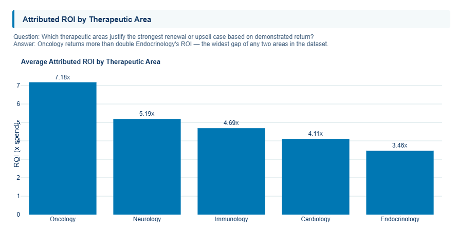
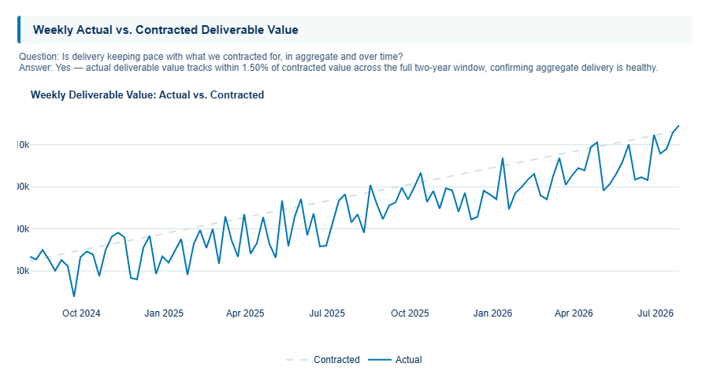
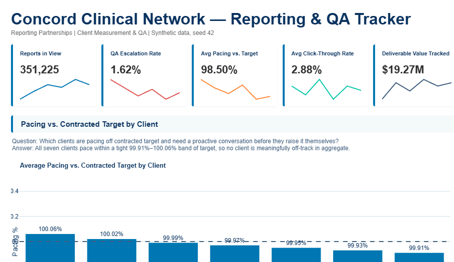

# 📊 Concord Clinical Network -- Reporting & QA Tracker

     

Using 351,225 synthetic weekly campaign reports across a fictional physician-reach media network, this project builds the rule-based QA checkpoint that catches reporting errors before a client sees them, plus a logistic-regression escalation-priority model (AUC 0.954) that concentrates 13.42% of real escalations into its single highest-risk decile, an 8.27x lift over the baseline rate.

---

## 📋 Table of Contents

- [Project Background](#-project-background)
- [Executive Summary](#-executive-summary)
- [Insights Deep Dive](#-insights-deep-dive)
- [Recommendations](#-recommendations)
- [Live Dashboard](#-live-dashboard)
- [Data Structure](#️-data-structure)
- [Setup](#️-setup)
- [File Structure](#-file-structure)
- [Assumptions and Caveats](#️-assumptions-and-caveats)
- [Author](#-author)

---

## 🏢 Project Background

Concord Clinical Network is a fictional physician-reach media network that pharma clients pay to advertise to HCPs across sponsored content, native display, video, and email placements. Clients contract for a weekly delivery target and pay a CPM-based rate; every week, Concord's Reporting Partnerships team has to produce a client-facing report on delivery, pacing, and engagement, and that report has to be right before it goes out -- a wrong number in a client deck is not a rounding error, it is a trust problem with a paying account.

The Reporting Assurance Program is Concord's internal initiative to make that QA checkpoint systematic rather than tribal knowledge held by whoever double-checks the numbers that week. The central business question it answers: which reports need a second look before they go out, why, and how does a QA analyst work through a growing queue of them without missing the ones that matter most. This mirrors the actual weekly cadence of the role -- pull the numbers, reconcile them, catch what is wrong, explain it to a non-technical client team, and do it again next week.

---

## 📊 Executive Summary

- Email leads every campaign format on click-through rate at **5.25%**, more than **4x** Native Display's **1.25%** -- the clearest format-mix lever in the book.
- The rule-based QA risk score flags **1.62%** of reports for escalation each cycle. The escalation-risk model built on top of it concentrates **13.42%** of all real escalations into its single highest-risk decile alone, an **8.27x** lift over the baseline rate (test AUC **0.954**).
- The duplicate-report-row check (SQL Section 1.3) catches **2,450** rows sharing an identical campaign/specialty/region/week business key -- a double-loaded feed defect that would silently inflate delivery numbers if it reached a client.
- Oncology campaigns return the strongest attributed ROI at **7.18x** spend, more than double Endocrinology's **3.46x**, the widest therapeutic-area gap in the book.
- In aggregate, actual deliverable value tracks **-1.50%** against contracted value across the full two-year window (**$19.27M** actual vs. **$19.57M** contracted) -- close to target overall, but **9.55%** of individual reports still breach the 80-120% pacing tolerance band.
- **4.00%** of reports carry missing telemetry, the rule score's second-largest risk contributor after pacing variance, and the input most often responsible for pushing a report into the escalation queue.

---

## 🔍 Insights Deep Dive

### 1. Email Outperforms Every Other Format on Click-Through Rate

Email lands in an inbox the physician chose to open. Native Display, Video, and even Sponsored Content are competing for attention inside content the HCP is already reading for some other reason. That built-in difference in intent is likely most of why email converts at **5.25%** CTR while Native Display trails at **1.25%**, with Sponsored Content (**3.35%**) and Video (**1.60%**) in between, more visible than a banner ad, but still earning attention rather than a deliberate open.

**What the chart shows:** look at how far the Email bar sits above the other three. That gap is bigger than any single therapeutic-area or region difference measured anywhere else in this project, which is what makes it the clearest single lever in the whole book if there's one format-mix decision to make this quarter.

*See: Campaign Leaderboard tab, "Average Click-Through Rate by Campaign Format."*



### 2. Duplicate-Row Detection Catches a Double-Loaded Feed Before It Reaches a Client

A double-loaded feed usually happens the boring way: a retry after a timeout that never got deduplicated, or two systems both pushing the same weekly extract. Because the duplicate rows carry the exact same campaign, specialty, region, and week, they don't look like an error, they look like real additional volume. That is what makes this defect dangerous. It silently inflates every downstream KPI for the affected campaigns with nothing throwing an error anywhere in the pipeline. SQL Section 1.3 catches it by grouping on that true business key and finding **2,450** rows caught in a duplicate.

**What the chart shows:** this signal sits on the Overview tab specifically so a reporting analyst sees it before writing a single client-facing number, not buried in a QA log discovered after the fact. Seeing the flag here is the difference between catching a double-counted feed internally and having a client ask why their impression count looks unusually high.

*See: Overview tab, "Data Quality Signals at a Glance"; SQL Section 1.3.*



### 3. The Escalation-Risk Model Concentrates Real Risk Into Its Top Decile

The rule-based QA score is deliberately simple, a QA analyst could reconstruct it by hand from three inputs: variance, missing data, and pacing deviation. What the rule can't see is which client, format, or specialty combinations have historically been more failure-prone. The logistic regression layered on top learns exactly that from historical patterns, which is why it can sharpen the queue order even though it starts from largely the same inputs as the rule. An AUC of **0.954** with an **8.27x** lift in the top decile means that when the model says "look here first," it is right far more often than picking reports off the queue at random.

**What the chart shows:** notice how much taller the decile-1 bar is than every other decile. If the model weren't actually separating real risk from noise, the bars would look roughly flat across deciles. A bar that towers over the rest like this one is what justifies routing decile 1 straight to same-day review instead of working the queue in whatever order reports happen to land.

*See: Model + Risk tab, "Escalation Rate by Risk Decile" and the confusion matrix.*



### 4. Oncology Leads Attributed ROI, Endocrinology Trails

Oncology campaigns reach a specialist audience making higher-stakes, higher-dollar treatment decisions, which makes a single follow-up action worth more in attributed revenue than the same click would be worth in a lower-acuity area like Endocrinology, where treatment decisions tend to be more routine. That difference in downstream dollar value, not a difference in engagement, is most of why Oncology's average attributed ROI reaches **7.18x** spend against Endocrinology's **3.46x**, with Neurology (**5.19x**), Immunology (**4.69x**), and Cardiology (**4.11x**) landing in between.

**What the chart shows:** this ranking is worth comparing against a raw engagement chart, because it doesn't necessarily match. Oncology sitting on top here, even where it isn't always the highest-clicking category elsewhere, is the signal that dollar-value follow-through, not just engagement volume, is what should drive the renewal conversation with a client.

*See: Financial Impact tab, "Attributed ROI by Therapeutic Area."*



### 5. Pacing Is On Target in Aggregate, But Nearly 1 in 10 Reports Individually Breaches Tolerance

An aggregate number can hide two clients cancelling each other out, one running hot, one running cold, while the blended total looks perfectly healthy. That is close to what's happening here: actual deliverable value lands within **1.50%** of contracted value across the full window, a clean top-line number, but **9.55%** of individual reports still fall outside the 80-120% pacing tolerance band. Somewhere in that mix, real clients are meaningfully over- or under-delivering even while the portfolio nets out close to target.

**What the chart shows:** look at how closely the aggregate actual-versus-contracted line tracks together, then look at the spread in the report-level distribution sitting behind it. That gap, a clean trend line paired with a real tail underneath it, is exactly why pacing is scored at the individual report level in this dashboard instead of only being rolled up to a client total.

*See: Overview tab, "Weekly Actual vs. Contracted Deliverable Value" (aggregate) and "Data Quality Signals at a Glance" (report-level distribution).*



---

## 💡 Recommendations

### Immediate Actions (0-30 Days)

**Work the decile-1 escalation queue first.** Route the Model + Risk tab's decile-1 report list to same-day QA review before those reports reach a client, converting the model from a postmortem report into a same-cycle catch.

**Fix the double-loaded feed producing duplicate report rows.** SQL Section 1.3 finds report rows sharing an identical campaign/specialty/region/week business key -- a double-submitted feed that silently inflates every downstream KPI until deduplicated.

### Short-Term Actions (30-90 Days)

**Target the lowest-pacing clients for a pacing conversation.** Use the Overview tab's pacing-by-client ranking to prioritize which accounts need a proactive pacing conversation before the client raises it first.

**Reallocate underperforming specialty x region targeting.** Use the Geographic & Specialty Performance tab's heatmap to shift budget away from the lowest click-through-rate specialty x region cells toward the highest-performing ones.

### Strategic Investments (90+ Days)

**Embed the QA risk score at report-generation time.** All three rule inputs (variance, missing data, pacing deviation) are knowable the moment a report is generated -- scoring at generation time converts this from a downstream QA pass into a pre-send control.

**Formalize the escalation-risk model as a queue-ranking service.** The decile-1 lift is strong enough to justify running the model as a lightweight scheduled job that re-ranks the queue daily as new reports land, rather than a one-time batch score.

---

## 🚀 Live Dashboard

| Dashboard | Link |
|---|---|
| Concord Clinical Network -- Reporting & QA Tracker | [](https://jsnzsatnlgjjddb9ywzjdu.streamlit.app/) |



---

## 🗂️ Data Structure

All data in this project is synthetic. The analysis-ready dataset (`data/concord_clinical_network.csv`) was generated to mirror how this data actually lives across a client/contract system, an ad-serving delivery log, and a QA review system -- see [Source Table Definitions](data/schema/table_definitions.md) and the [entity-relationship diagram](data/schema/erd.md) for the source schema and join logic this flat file would be built from.

Dataset: 351,225 rows | Seed: 42 | 2,420 campaigns across 7 fictional pharma clients | 2-year reporting window (Aug 2024 - Aug 2026)

| Column | Type | Description |
|---|---|---|
| report_id / campaign_id | string | Unique report row / parent campaign identifier |
| client_name / therapeutic_area | categorical | 7 fictional pharma clients across 5 therapeutic areas |
| campaign_format | categorical | Sponsored Content, Native Display, Video, Email |
| physician_specialty / region | categorical | 10 HCP specialties x 5 US regions |
| report_week / weeks_since_launch | date / integer | Reporting week and campaign week index |
| impressions / clicks / content_engagements / specialty_verified_reach / follow_up_actions | integer | The HCP engagement funnel, impression through follow-up action |
| contracted_impressions / cpm_usd / contracted_deliverable_value_usd / actual_deliverable_value_usd / pacing_pct | float | Contract terms, delivered value, and pacing vs. target |
| attributed_roi | float | Illustrative dollar-value follow-through by therapeutic area |
| reported_metric_variance_pct / missing_data_flag / pacing_deviation_flag | float / boolean | Rule-based QA input signals |
| qa_risk_score / qa_risk_tier | float / categorical | **Rule-based**, same-week, fully auditable QA risk score |
| flagged_for_qa_escalation | binary | **Primary model target** -- report required QA correction/escalation |
| escalation_risk_score / escalation_risk_decile | float / integer | Escalation-priority model outputs -- rank the queue, never override the rule |

Full column-by-column reference: [data/data_dictionary.md](data/data_dictionary.md)

Leakage and overlap notes (escalation-risk model):

| Column | Risk | Reason |
|---|---|---|
| escalation_risk_score, escalation_risk_decile | HIGH | Model outputs, not inputs -- would leak if reused in retraining |
| report_id, campaign_id | HIGH | Identifiers, never model features |
| qa_risk_score and its 3 inputs (variance, missing data, pacing deviation) | Deliberate overlap, not leakage | The model is designed to sit on top of the rule and reuse its inputs -- see `data/data_dictionary.md` for the full explanation |

---

## ⚙️ Setup

```
# 1. Clone the repo
git clone https://github.com/Luciano-Casillas/concord-clinical-reporting-tracker.git
cd concord-clinical-reporting-tracker

# 2. Install dependencies
pip install -r requirements.txt

# 3. Run the dashboard
streamlit run app.py
```

> Note: The analysis-ready dataset is committed to this repo at `data/concord_clinical_network.csv`. No data generation step is required to run the dashboard. To regenerate it (requires `scikit-learn`, not otherwise needed by the dashboard): `python scripts/01_generate_data.py`.

---

## 📁 File Structure

```
concord-clinical-reporting-tracker/
|-- README.md                          # This file
|-- app.py                             # Streamlit dashboard (8 tabs)
|-- requirements.txt                   # Python dependencies
|-- portfolio_page.html                # Standalone shareable project page
|-- .streamlit/
|   |-- config.toml                    # Dashboard theme configuration
|-- scripts/
|   |-- 01_generate_data.py            # Synthetic dataset generator + escalation model trainer
|   |-- quality_gate.py                # Validation checks, run before every commit
|-- data/
|   |-- concord_clinical_network.csv   # Analysis-ready dataset (351,225 rows)
|   |-- data_dictionary.md             # Column reference with leakage documentation
|   |-- metadata.json                  # Generation parameters, model metrics
|   |-- schema/
|       |-- erd.md                     # Entity-relationship diagram (Mermaid)
|       |-- table_definitions.md       # Source table grain and join logic
|-- sql/
|   |-- concord_clinical_network_analysis.sql   # 17 queries across 5 sections
|-- docs/
|   |-- PROJECT_OVERVIEW.md            # ~65-word elevator pitch
|-- screenshots/                       # Dashboard screenshots for this README
```

---

## ⚠️ Assumptions and Caveats

**Synthetic data:** All data in this project is synthetic, generated with `numpy.random.default_rng(42)` for reproducibility. It is designed to produce realistic analytical patterns -- including a genuine format-level CTR gap and a probabilistic (not deterministic) link between the QA risk score and the escalation target -- but does not represent any real company, client, or campaign. An initial pass produced an unrealistic impressions scale (millions of weekly impressions per HCP segment); this was caught during development and corrected at the generator level before the dataset was finalized. See `scripts/01_generate_data.py` for the corrected logic.

**Modeling assumptions:**
- Target variable: `flagged_for_qa_escalation`, a genuinely JD-authentic target (not a churn or propensity proxy borrowed from a different domain).
- The rule-based `qa_risk_score` and the escalation-risk model are deliberately kept separate: the rule is same-week, deterministic, and fully explainable to a client; the model is an internal triage aid layered on top and is never shown to a client or allowed to override the rule.
- Model algorithm: `LogisticRegression` (scikit-learn), chosen for the same reason as the rule itself -- this is a reporting-focused role where an analyst needs to explain a flagged report in one sentence, not defend a black-box score.

**Business assumptions:**
- `attributed_roi` uses an illustrative, per-therapeutic-area dollar value per follow-up action, documented in `data/data_dictionary.md` as illustrative, not a claimed real-world pharma valuation.
- `Concord Clinical Network` and every client name in this dataset are fictional, invented for this project and not a stand-in for any real company (see `data/data_dictionary.md` and `data/schema/table_definitions.md`).
- The 80-120% pacing tolerance band and the QA risk score's weighting (variance 0.35, missing data 30, pacing deviation 25) are illustrative thresholds chosen for this project, not externally validated industry benchmarks.

---

## 👤 Author

Luciano Casillas

Independent Analytics Consultant

[](https://linkedin.com/in/luciano-casillas) [](https://github.com/Luciano-Casillas)

<luciano.casillasjr@outlook.com>
