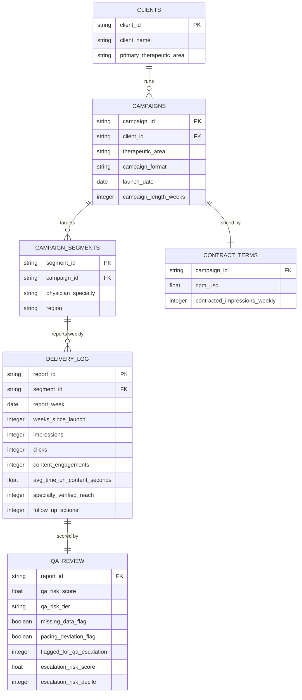

# Entity-Relationship Diagram

Source-system schema behind the analysis-ready `data/concord_clinical_network.csv`
extract. See `table_definitions.md` in this directory for column-level detail and
the join logic.

`DELIVERY_LOG.report_id` carries a small number of intentional duplicate business
keys (`segment_id` + `report_week` appearing twice) -- a simulated double-loaded
feed from the ad-serving system, the kind of defect the QA/data-quality SQL
section is built to catch. See `data/data_dictionary.md` for full column
definitions and leakage notes on the escalation-risk model.
